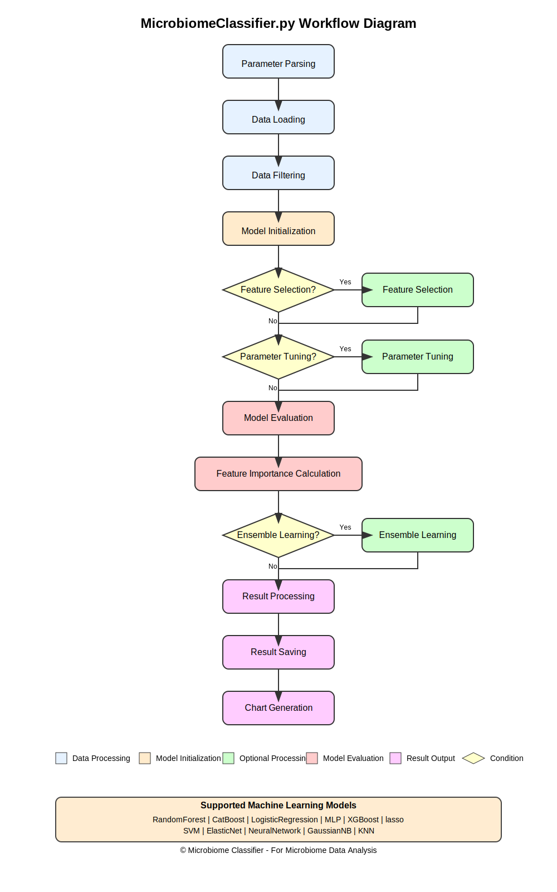

# MicrobiomeClassifier.py Project Documentation

## Project Overview
MicrobiomeClassifier.py is a Python script designed for processing microbiome data. Its main functionalities include data loading, filtering, feature selection, model training, and evaluation. The script supports various machine learning models and provides parameter tuning and ensemble learning capabilities.

## Workflow Diagram
The following diagram illustrates the complete workflow of MicrobiomeClassifier.py, including data loading, preprocessing, feature selection, model training, evaluation, and result output:



## Installation and Requirements

### Environment Setup
```bash
# Create Python 3.11 environment
conda create -n MClassifier python=3.11

# Activate environment
conda activate MClassifier

# Install dependencies
conda install -y scikit-learn pandas numpy matplotlib seaborn
conda install -y -c conda-forge catboost xgboost
conda install -y pytorch tqdm joblib
```

### System Requirements
- Python 3.11+
- Dependencies:
  - scikit-learn
  - pandas
  - numpy
  - matplotlib
  - seaborn
  - catboost
  - xgboost
  - torch
  - tqdm
  - joblib

## Parameter Description
| Parameter | Type | Required | Description |
|-----------|------|----------|-------------|
| --prof_file | str | Yes | Path to species abundance data file |
| --metadata_file | str | Yes | Path to metadata file |
| --target | str | Yes | Target type (Project/Disease) |
| --target_id | str | No | Target ID |
| --models | str | No | List of models (comma-separated), options: RandomForest, CatBoost, LogisticRegression, MLP, XGBoost, lasso, SVM, ElasticNet, NeuralNetwork, GaussianNB, KNN, GMWI2 (GMWI2 Under development, not supported yet) |
| --feature | bool | No | Disable feature selection |
| | | | Note: Due to the small size of example data, feature selection may not work properly, so all example codes set this to No. Actual data can use feature selection normally. |
| --turner | bool | Yes | Enable parameter tuning |
| --ensemble | bool | No | Enable ensemble learning (Under development, not supported yet) |
| --y_cohort_group | bool | No | Return cohort information |
| --y_cohort_type | str | No | Cohort information type (Project/Disease), default is Project |
| --pres | bool | No | Use presence/absence profile or relative abundance profile |
| --cpu | int | No | Number of CPU cores to use |
| --repeat | int | No | Number of repetitions |
| --cv | int | No | Number of cross-validation folds, default is 5 |
| --output | str | Yes | Output directory |

## Usage Examples
```bash
# Basic Usage (Project Classification)
# Example 1: Project Classification without Feature Selection
# --prof_file: Input species abundance data file
# --metadata_file: Sample metadata file
# --target Project: Classify by project
# --target_id ProjectA: Specify target project as ProjectA
# --models: Use LASSO and Logistic Regression models (available models: RandomForest, CatBoost, LogisticRegression, MLP, XGBoost, lasso, SVM, ElasticNet, NeuralNetwork, GaussianNB, KNN, GMWI2)
# --feature No: Disable feature selection
# --turner Yes: Enable parameter tuning
# --pres No: Use relative abundance data
# --repeat 10: Repeat experiment 10 times
# --cv 10: Use 10-fold cross-validation
# --cpu 4: Use 4 CPU cores
python MicrobiomeClassifier.py --prof_file test/prof_test.csv --metadata_file test/metadata_test.csv --target Project --target_id ProjectA --output ./result_abun --models lasso,LogisticRegression --ensemble No --feature No --turner Yes --pres No --repeat 10 --cv 10 --cpu 4

# Example 2: Project Classification with Raw Features
# Main differences from Example 1:
# --feature No: Disable feature selection
# --pres Yes: Use presence/absence data
python MicrobiomeClassifier.py --prof_file test/prof_test.csv --metadata_file test/metadata_test.csv --target Project --target_id ProjectA --output ./result_pres --models lasso,LogisticRegression --ensemble No --feature No --turner Yes --pres Yes --repeat 10 --cv 10 --cpu 4

# Basic Usage (Disease Classification)
# Example 3: Disease Classification without Feature Selection
# --target Disease: Classify by disease type
# --target_id DiseaseA: Specify target disease as DiseaseA
python MicrobiomeClassifier.py --prof_file test/prof_test.csv --metadata_file test/metadata_test.csv --target Disease --target_id DiseaseA --output ./result_abun --models lasso,LogisticRegression --ensemble No --feature No --turner Yes --pres No --repeat 10 --cv 10 --cpu 4

# Single Disease (Disease Classification with LOCO - Leave One Cohort Out)
# Example 4: Using LOCO Cross-validation
# --y_cohort_group Yes: Enable cohort grouping
# --y_cohort_type Project: Group cohorts by project
python MicrobiomeClassifier.py --prof_file test/prof_test.csv --metadata_file test/metadata_test.csv --target Disease --target_id DiseaseA --y_cohort_group Yes --y_cohort_type Project --output ./result_abun --models lasso,LogisticRegression --ensemble No --feature No --turner Yes --pres No --repeat 10 --cv 10 --cpu 4

# All Samples (OneMajorDisease with LODO - Leave One Disease Out)
# Example 5: Using LODO Cross-validation
# --target OneMajorDisease: Classify major diseases
# --y_cohort_type Disease: Group cohorts by disease type
python MicrobiomeClassifier.py --prof_file test/prof_test.csv --metadata_file test/metadata_test.csv --target OneMajorDisease --y_cohort_group Yes --y_cohort_type Disease --output ./result_abun --models lasso,LogisticRegression --ensemble No --feature No --turner Yes --pres No --repeat 10 --cv 10 --cpu 4
```

## Output Files Description
- scores.csv: Model evaluation scores
- predictions.csv: Prediction results
- whole_predictions.csv: Complete prediction results
- features.csv: Selected features (if feature selection is enabled)
- imp.csv: Feature importance scores
- Various charts (PDF format)

## Important Notes
1. Ensure input files are in the correct format
2. Feature selection will increase runtime
3. Parameter tuning requires more computational resources
4. Output directory will be created automatically